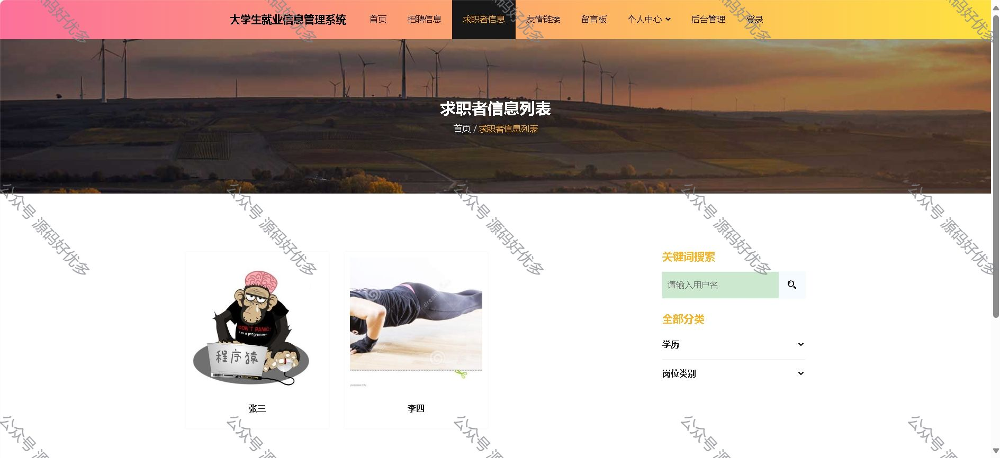
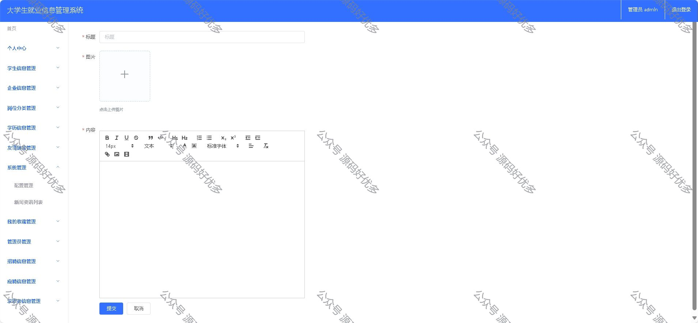

 
## 查看主页获取源码

> **作者介绍**： **✌**全网粉丝10W+本平台特邀作者、博客专家、CSDN新星计划导师、java领域优质创作者,博客之星、掘金/华为云/阿里云/InfoQ等平台优质作者、专注于毕业项目实战 **✌**

  

### 一、作品包含

源码+数据库+全套环境和工具资源+部署教程

### 二、项目技术

前端技术：Html、Css、Js、Layui、Vue

数据库：MySQL

后端技术：Java、Spring Boot、MyBatis

  

### 三、运行环境

开发工具：IDEA

数据库：MySQL8.0

数据库管理工具：Navicat10以上版本

环境配置软件： JDK1.8+Maven3.6.3
  

### 四、项目介绍
项目编号：springbootA035

大学生就业信息管理系统分为三个角色：管理员、企业、求职者。
功能:登录、注册功能、学生信息管理、企业信息管理、岗位分类管理、学历信息管理、应聘信息管理、求职者信息管理、招聘信息管理。

### 五、运行截图

